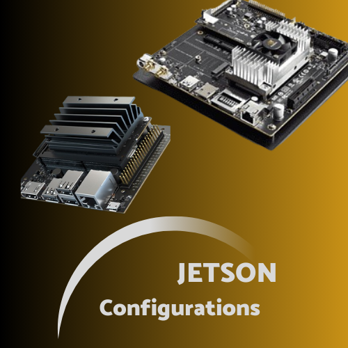

# Nvidia-jetson complete configurations
Complete configuration of jetson

create virtual environment in jetson  , install python3.8 in jetson ,  install ultralytics in jetson , install pyqt5 in jetson


<div align="center">
  
</div>


# Configure Python 3.8 on Jetson Nano (jetpack 4.x)

Jetpack 4.x supports python 3.6 by default on base environment

Nvidia recommends not to upgrade this python version. If we want to install another Python version we can build python from source to avoid conflicts. Following are the key steps to install python==3.8:

run following commands one by one in terminal
```bash
sudo apt update sudo apt upgrade 
sudo apt install build-essential libssl-dev zlib1g-dev libncurses5-dev libncursesw5-dev libreadline-dev libsqlite3-dev libgdbm-dev libdb5.3-dev libbz2-dev libexpat1-dev liblzma-dev libffi-dev libc6-dev 
```
Download the Python source code for version 3.8 from the official Python website. You can use the following command to download it directly to your Jetson Nano:
```bash
wget https://www.python.org/ftp/python/3.8.12/Python-3.8.12.tar.xz 
```
Extract the downloaded archive by running the following command:
```bash
tar -xf Python-3.8.12.tar.xz
cd Python-3.8.12 
```
Configure the build process:
```bash 
./configure --enable-optimizations 
```
Build Python:
```bash 
make -j4 
```
Once the compilation is complete, you can install Python by running the following command: 
```bash
sudo make altinstall python3.8 --version 
```
That's it! You have successfully installed Python 3.8 on your Jetson Nano. 

Now you have two python versions on Jetson nano 3.6.9 and 3.8.
for python 3.6.9 use python3.6
```bash
python3.6 –version
```
for python 3.8 use python3.8
```bash
python3.8 –version
```
# Create Virtual Environment with Python 3.8 on jetson Nano (jetpack4.x)

Jetson nano jetpack 4.x contains python 3.6.9, which is an older version. If we want to create a Python Virtual Environement with python 3.8 than follow the following steps

First of all install Python 3.8 in the base environment (Follow the above given instructions in section I)

create a separate environment using python 3.8. execute following commands in terminal
```bash
python3.8 -m venv myenv 
source myenv/bin/activate
```
check python version
```bash
python –version
```
# Configure Torch and Torchvision with Python 3.8 on jetson Nano (jetpack4.x)
Follow the following steps to get cuda configured torch and torchvision

(if you did not install python 3.8 manually than first install python3.8 on the base by following section I.)
I you already installed python 3.8 and made python virtual environement then you can skip these steps
```bash
python3.8 -m venv venv 
source venv/bin/activate
```
install necessary libraries
```bash
pip install -U pip wheel gdown
```
Download pytorch 1.11.0 
```bash
gdown https://drive.google.com/uc?id=1hs9HM0XJ2LPFghcn7ZMOs5qu5HexPXwM 
```
Download torchvision 0.12.0 
```bash
gdown https://drive.google.com/uc?id=1m0d8ruUY8RvCP9eVjZw4Nc8LAwM8yuGV
```
install downloaded torch and torchvision
```bash
python3.8 -m pip install torch-*.whl torchvision-*.whl
```
open python in terminal
```bash
python3.8
```
run the following python code
```bash
import torch
print(torch.__version__)  # Check PyTorch version
print(torch.cuda.is_available())  # Check if CUDA is available
```
If the answer is "True" Congrats.... you have cuda supported torch available in python virtual environment (venv)
# Run yolov8 Ultralytics
clone the ultralytics repository
```bash
git clone https://github.com/ultralytics/ultralytics
cd ultralytics
```
Install the Python package for YOLOv8
```bash
pip install .
```
RunYoloV8 for detection task
```bash
yolo task=detect mode=predict model=yolov8n.pt source=0 show=True 
```
RunYoloV8 for segmentation task
```bash
yolo task=segment mode=predict model=yolov8n-seg.pt source=0 show=True
```
# Configure PyQt5 from Source in Jetson
run following command 
```bash
sudo apt-get install libx11-*
sudo apt-get install libx11*
sudo apt-get install libxcb-*
sudo apt-get install libxcb*
sudo apt-get install libxkbcommon-dev
sudo apt-get install libxkbcommon-x11-dev
```
Download Qt source:
if you need the whole Qt5 (~900MB):
```bash
wget http://master.qt.io/archive/qt/5.15/5.15.2/single/qt-everywhere-src-5.15.2.tar.xz 217
```
if you need the qtbase only
qtbase (basic module such as QtCore, QtGui and QtWidget)(~90MB):
```bash
wget http://master.qt.io/archive/qt/5.15/5.15.2/submodules/qtbase-everywhere-src-5.15.2.tar.xz 145
```
Now configure and install Qt5 (here I used qtbase):
```bash
       tar -xpf qtbase-everywhere-src-5.15.2.tar.xz
```
```bash
cd qtbase-everywhere-src-5.15.2/
./configure -xcb
```
(must enable xcb here manually)
Choose “o” to install Qt open source version.
```bash
make -j4
```
install make files
```bash
sudo make install
```
Now we have Qt5 under /usr/local/Qt-5.15.2
